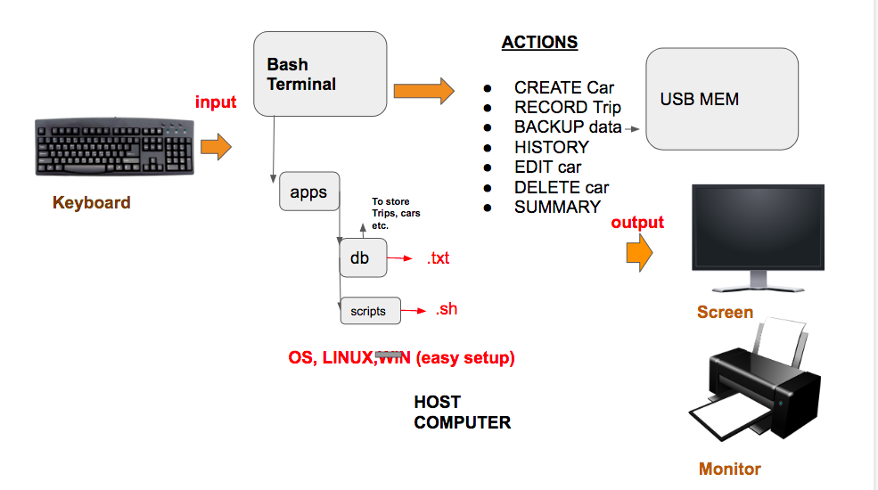

Car Rental Minimal App
===========================

A car rental management minimal app in Bash.

Contents
-----
  1. [Planning](#planning)
  1. [Design](#design)
  1. [Development](#development)
  1. [Evalution](#evaluation)

Planning
---------
We will create a program for a car company that is trying to log their car orders into a system. The program will run in terminal since the company does not want to download additional program to their pcs, it should have a simple and transparent installation, it should be very user friendly; so the users will add cars, record trips, have the trip history, edit and delete any car without a burden. The commands should be easy so the user can enter the trip distance (in kilometers). In addition, the company requests to have permanent system and backup to minimise the risk of failure. Also, the program will show the total statistics so it is more manageable.

### Definiton of the problem

### Solution Proposed

### Success Criteria
This are measureable outcomes
1. A car can be created and stored in database
2. A car information can be edited
3. A car can be deleted
4. The installation is ***simple-> one step process***
5. A summary (total/average distance traveled) can be generated for a particular car
6. Trips can be recorded and stored for an existing car
7. A basic database system is implemented
8. A basic backup functionality is available.

Design
-------
### First sketch of the system


Development
--------
### Development of the functions; Create new car:
The following steps summarize the algorithm to create a new car in the system
1) Get inputs (Plate, Model, Color, Parranger number)
2) Check number of arguments if 4 then continue, if not exit "message
3) Write to main file with one extra line. Not erasing other Entries
4) Create car trip file with Licence plate.txt

### Summary Actions:


### 1. The following script crates the app folder and inside it creates two more folders: db and scripts.


Evaluation
-----------
Test 1:
The first run of the test file was unsuccessful because the Database folder was non existent
Also the create program did not store the licence file inside the Database folder.
Changing the line `echo " " > $license.txt` to `echo " " > Database/$license.txt` Solved this issue.
Second run of the program we had an issue: the test needed to move to the main folder
```.sh
cd ../
```
This is necessary because the `create.sh` resides in the main folder whereasthe test file
is inside the /tests folders.
To check that the car was creatd in the maincarfile.txt, the folowing command is used:
`lastline = $( tail -n 1 Database/maincarfile.txt)`
This line is used so we don't need to `cat` the program and check the whole file. Instead we use this line
to check the last lines of the maincarfile.txt

We faced a problem: Too many arguments. We added quoting marks in order to show it as 1 sentence instead of multiple arguments.

**Summary:** We were the alpha tester of the program, we did dynaminc testing using White-box testing method.
